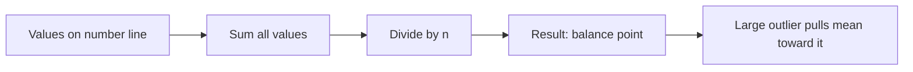
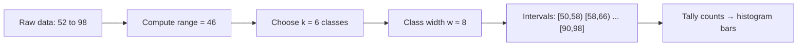
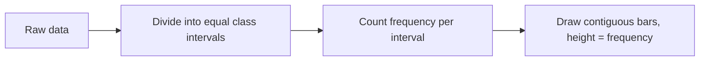
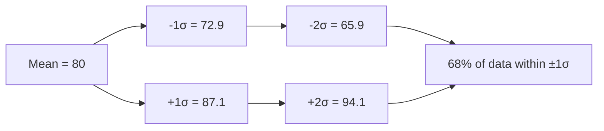

# SPL Run: build_concept_book

- **Adapter:** claude_cli
- **Model:** claude-sonnet-5
- **Tokens:** 11327 in / 6221 out
- **Latency:** 164516ms
- **Timestamp:** 2026-09-27 13:08:54

## Output

```output


---

## Frequency

The **frequency** of a value in a data set is the number of times that value occurs. If a data set records the number of siblings for 20 students, and the value 2 appears 6 times, then the frequency of "2 siblings" is 6. Frequencies are typically organized into a **frequency table**, which lists each distinct value alongside its count, and often a **relative frequency** — the frequency divided by the total number of observations, expressed as a proportion or percentage.

**Worked example.** Suppose a teacher records the number of pets owned by 15 students:

$$1, 2, 0, 1, 3, 2, 1, 1, 0, 2, 2, 1, 4, 1, 2$$

Tallying each value gives the frequency table:

| Number of pets | Frequency | Relative frequency |
|---|---|---|
| 0 | 2 | $2/15 \approx 0.133$ |
| 1 | 6 | $6/15 = 0.400$ |
| 2 | 5 | $5/15 \approx 0.333$ |
| 3 | 1 | $1/15 \approx 0.067$ |
| 4 | 1 | $1/15 \approx 0.067$ |

The relative frequencies sum to 1 (allowing for rounding), since every observation is accounted for exactly once. This table immediately reveals the shape of the data: owning 1 pet is the most common outcome (the **mode**), while owning 3 or 4 pets is rare.

**Problem-solving application.** Frequency tables are the foundation for nearly every downstream statistical tool: histograms are built by plotting frequency against value, probability estimates from empirical data use relative frequency as a stand-in for probability, and measures like the mode are defined directly in terms of frequency. When solving a problem that asks "how often," "how many," or "what proportion," the first step is almost always to construct or consult a frequency table before computing anything else. For instance, to estimate the probability that a randomly selected student from this class owns at least 2 pets, sum the frequencies for 2, 3, and 4 pets ($5 + 1 + 1 = 7$) and divide by the total ($15$), giving an estimated probability of $7/15 \approx 0.467$. This illustrates the general principle: frequency counts convert raw, unordered data into a structured summary that supports both description (what does the data look like?) and inference (what can we predict from it?).

---

## Mean

The **mean** is the arithmetic average of a data set: sum every value, then divide by how many values there are. For a set of $n$ observations $x_1, x_2, \ldots, x_n$, the mean is

$$\bar{x} = \frac{1}{n}\sum_{i=1}^{n} x_i$$

This single formula applies whether the data come from a complete population or from a sample drawn out of a larger one — later sections will introduce separate notation to distinguish those two cases, but the arithmetic is identical either way.

**Worked example.** A study measures the resting heart rate (beats per minute) of 6 volunteers: 62, 68, 71, 65, 70, 66. The sum is $62+68+71+65+70+66 = 402$. Dividing by $n=6$ gives $\bar{x} = 402/6 = 67$ bpm. This single number summarizes the "center" of the data.

**Problem-solving application.** The mean is not just a summary statistic — it is a *balance point*. If each data value were a weight placed on a number line, the mean is the position where the line balances perfectly: the values above it pull just as hard, on average, as the values below it pull the other way. This is why a single extreme value can distort the mean disproportionately — it adds a lot of pull on one side without anything on the number line to counterbalance it.

Suppose a 7th volunteer with a heart rate of 130 bpm (a measurement error) is added to the study. The new mean becomes $(402+130)/7 \approx 76$ bpm — a shift of 9 points caused by a single outlier, even though five of the seven original values are clustered near 65–70. This sensitivity to extreme values is why analysts often report the mean alongside the median, and why identifying and cleaning outliers before averaging is a standard first step in data analysis.


*The mean as a balance point: summing and dividing locates the fulcrum of the data, and an extreme value shifts that fulcrum.*

---

## Class Interval

A **class interval** is a fixed-width range of values used to group raw data into the bars (bins) of a histogram. Each interval has a lower bound and an upper bound, and every data value falls into exactly one interval. The **width** of a class interval is the difference between consecutive boundaries, and choosing this width well is what turns a cloud of numbers into a readable distribution: too wide, and you lose structure (everything collapses into one or two bars); too narrow, and the histogram becomes noisy, with many nearly-empty bars.

**Worked example.** Suppose you have 30 exam scores ranging from 52 to 98. A common rule of thumb (Sturges' rule) suggests the number of classes $k \approx 1 + \log_2 n$, so for $n = 30$, $k \approx 1 + \log_2 30 \approx 5.9$, round to 6 classes. The data range is $98 - 52 = 46$, so the class width is

$$
w = \frac{\text{range}}{k} = \frac{46}{6} \approx 7.7 \rightarrow 8 \text{ (rounded up)}
$$

Starting at 50, the class intervals become $[50,58), [58,66), [66,74), [74,82), [82,90), [90,98]$. Every score is tallied into exactly one interval, and the tally counts become the bar heights of the histogram.

**Problem-solving application.** The choice of starting point and width is not arbitrary — it directly affects what patterns you can see. Shifting the starting point by even a few units can merge or split a cluster of values, changing the apparent shape of the distribution (e.g., making a mildly skewed distribution look symmetric). When constructing a histogram, always: (1) compute the range, (2) pick a reasonable number of classes using a rule of thumb or by trial, (3) round the width to a convenient number (5, 10, 0.5, etc.) rather than an awkward decimal, and (4) verify that every data point falls into one and only one interval, with no gaps or overlaps at the boundaries — this is why intervals are typically written half-open, like $[50, 58)$, so a value of exactly 58 is unambiguously assigned to the next class.



*How raw data is converted into class intervals and then into histogram bars.*

---

## Relative Frequency

Relative frequency measures the proportion of a dataset that falls into a particular category or takes a particular value. If a value $x_i$ appears with frequency $f_i$ (the count of times it occurs) in a dataset of total size $n$, its relative frequency is

$$
rf_i = \frac{f_i}{n}
$$

Because every observation belongs to exactly one category, the relative frequencies of all distinct values in a dataset must sum to 1: $\sum_i rf_i = 1$. This makes relative frequency directly interpretable as a proportion or, under repeated random sampling, an empirical estimate of probability — the foundation of the frequentist interpretation of probability.

**Worked example.** A quality-control inspector samples 200 light bulbs from a production line and finds 8 defective. The frequency of "defective" is $f = 8$, and $n = 200$, so

$$
rf_{\text{defective}} = \frac{8}{200} = 0.04
$$

This means 4% of the sampled bulbs were defective. Relative frequency turns a raw count, which depends on sample size and is hard to compare across datasets, into a standardized proportion that can be compared directly — for example, against a factory's target defect rate of 2%, or against another day's sample of 500 bulbs with 15 defective ($rf = 0.03$).

**Problem-solving application.** Relative frequencies are the building block of frequency distributions and histograms: instead of plotting raw counts on the vertical axis, plotting $rf_i$ lets you compare datasets of different sizes on the same scale, and it lets you read off an estimated probability directly from the graph. They also let you reconstruct expected counts: if a survey of 1,000 voters shows a candidate's relative frequency of support at $0.37$, you'd expect about $370$ supporters, and you can attach a margin of error to that estimate using the sample size $n$. When relative frequencies are computed from a large enough sample under consistent conditions, the Law of Large Numbers guarantees they converge to the true underlying probability — which is precisely why we trust polls, defect-rate estimates, and experimental probabilities more as $n$ grows.

---

## Variance

Variance measures how spread out a set of data values is around their mean. For a population of $n$ values $x_1, x_2, \ldots, x_n$ with mean $\mu$, the population variance is

$$
\sigma^2 = \frac{1}{n}\sum_{i=1}^{n} (x_i - \mu)^2
$$

Each term $(x_i - \mu)^2$ is a squared deviation: how far a value sits from the mean, squared so that negative and positive deviations don't cancel out. Averaging these squared deviations gives a single number summarizing overall spread. When working with a sample rather than the full population, the formula divides by $n-1$ instead of $n$:

$$
s^2 = \frac{1}{n-1}\sum_{i=1}^{n} (x_i - \bar{x})^2
$$

This adjustment (Bessel's correction) compensates for the fact that a sample mean $\bar{x}$ is itself estimated from the data, which would otherwise make $s^2$ systematically underestimate the true population variance.

**Worked example.** Consider exam scores $\{72, 85, 90, 78, 95\}$. The mean is $\bar{x} = (72+85+90+78+95)/5 = 84$. The deviations are $-12, 1, 6, -6, 11$, and squaring gives $144, 1, 36, 36, 121$, which sum to $338$. Treating this as a sample, $s^2 = 338/4 = 84.5$. Notice the units: since we squared original score values, variance is measured in "points squared," which is why standard deviation — the square root of variance — is preferred when reporting spread in the original units.

**Problem-solving application.** Variance is the computational core of many statistical procedures, not just descriptive summaries. In finance, portfolio risk is quantified as the variance of returns; a portfolio combining two assets has variance $\sigma_p^2 = w_1^2\sigma_1^2 + w_2^2\sigma_2^2 + 2w_1w_2\,\text{Cov}(1,2)$, where covariance links back to the same squared-deviation logic. In quality control, engineers compare the variance of a manufacturing process against a tolerance threshold to decide whether the process is stable. When solving such problems, always identify first whether you're working with a full population or a sample, since choosing the wrong denominator ($n$ vs. $n-1$) introduces a systematic bias that compounds in downstream calculations like standard deviation, confidence intervals, and hypothesis tests.

---

## Histogram

A histogram displays how a numerical data set is distributed by grouping values into equal-width **class intervals** (also called bins) and drawing a bar over each interval whose height equals the frequency — the count of data points that fall inside it. Because the horizontal axis represents a continuous numerical scale, the bars are drawn contiguously, with no gaps between them. This is what distinguishes a histogram from a bar chart, where the categories are discrete and gaps between bars are conventional. The vertical axis can show raw frequency or relative frequency (proportion of the total), and the choice of bin width strongly affects the picture: too few bins hides structure, too many bins makes the shape look noisy.

**Worked example.** Suppose 20 students' quiz scores (out of 10) are recorded: 3, 5, 6, 6, 7, 7, 7, 8, 8, 8, 8, 9, 9, 9, 6, 7, 5, 8, 9, 6. Using class intervals of width 2 — $[2,4)$, $[4,6)$, $[6,8)$, $[8,10]$ — we tally frequencies: 1, 3, 8, 8. Plotting bars of these heights over the four intervals shows a distribution skewed toward higher scores, with a peak in the upper half — information that is invisible from the raw list of numbers alone.

**Problem-solving application.** Choosing bin width is a genuine quantitative decision, not an aesthetic one. A common rule of thumb, Sturges' rule, suggests the number of bins $k$ for $n$ data points as
$$
k = \lceil \log_2 n \rceil + 1.
$$
For $n = 20$, this gives $k = \lceil 4.32 \rceil + 1 = 6$ bins, and bin width is then $\text{width} = \dfrac{\text{range}}{k}$. This matters in practice: a histogram with too coarse a bin width can mask a bimodal distribution (two distinct peaks, suggesting two subpopulations), while one that is too fine can make a smooth underlying pattern look like random noise. When comparing histograms across data sets of different sizes, converting to relative frequency (dividing each bar's count by $n$) is essential — otherwise differences in height reflect sample size rather than shape.


*Steps for constructing a histogram from raw data; note the absence of gaps between bars, unlike a bar chart.*

---

## Standard Deviation

The standard deviation, denoted $\sigma$ (population) or $s$ (sample), is the square root of the variance: $\sigma = \sqrt{\sigma^2}$. Taking the square root matters for one crucial reason — variance is expressed in squared units (e.g., dollars², cm²), which have no direct physical interpretation. Standard deviation restores the original units, so it can be compared directly to the mean and to individual data points. It measures the "typical" distance of a data value from the mean.

**Worked example.** Suppose a class's quiz scores are $70, 75, 80, 85, 90$, with mean $\bar{x} = 80$. The deviations from the mean are $-10, -5, 0, 5, 10$. Squaring and averaging gives the variance:
$$
\sigma^2 = \frac{(-10)^2+(-5)^2+0^2+5^2+10^2}{5} = \frac{250}{5} = 50
$$
So $\sigma = \sqrt{50} \approx 7.07$ points. This tells us that scores typically deviate from 80 by about 7 points — a single number summarizing spread, in the same units (points) as the original data.

**Problem-solving application.** Standard deviation lets you judge whether an individual value is ordinary or extreme, using the standardized (z-) score:
$$
z = \frac{x - \bar{x}}{\sigma}
$$
For roughly bell-shaped (normal) distributions, the empirical rule states that about 68% of values fall within $\pm 1\sigma$ of the mean, 95% within $\pm 2\sigma$, and 99.7% within $\pm 3\sigma$. This gives you a fast diagnostic: if a data point has $|z| > 2$, it lies outside the range containing 95% of typical observations and deserves scrutiny — whether that means flagging a defective part on a factory line, identifying an unusually fast reaction time in a psychology experiment, or detecting fraud in transaction data. Standard deviation also underlies comparing risk between two investments with the same average return: the one with larger $\sigma$ is riskier, since its outcomes swing further from the mean.


*The empirical rule: proportions of data captured within one and two standard deviations of the mean.*

---

## Chebyshev And Empirical Rules

Both rules answer the same question — what fraction of data lies within $k$ standard deviations of the mean? — but they answer it under different assumptions about the distribution's shape.

**The core idea.** For any dataset with mean $\mu$ and standard deviation $\sigma$, define the *within-$k$-sigma proportion* as the fraction of data falling in the interval $\mu \pm k\sigma$. Chebyshev's Rule gives a guaranteed minimum for this proportion that holds for *any* distribution, no matter how skewed or irregular:

$$
\text{proportion within } k\sigma \;\geq\; 1 - \frac{1}{k^2}, \qquad k > 1
$$

For $k=2$, this guarantees at least $1 - \tfrac14 = 75\%$ of data lie within $\mu \pm 2\sigma$. For $k=3$, at least $1 - \tfrac19 \approx 88.9\%$. This is a worst-case bound — the true proportion could be higher, but never lower.

When the distribution happens to be bell-shaped and symmetric (approximately normal), the *same* within-$k$-sigma proportion is known exactly rather than bounded from below. This is the Empirical Rule, often called the 68-95-99.7 rule: about 68% of data fall within $\mu \pm 1\sigma$, about 95% within $\mu \pm 2\sigma$, and about 99.7% within $\mu \pm 3\sigma$ — each a tighter, more informative version of the same $k=1,2,3$ cases Chebyshev covers only loosely.

**Worked example.** Exam scores have $\mu = 75$, $\sigma = 8$. If scores are normally distributed, the Empirical Rule says about 95% of students scored between $75 - 16 = 59$ and $75 + 16 = 91$. If instead the distribution is skewed (say, a hard subset of questions pulled some scores down), we can't use the Empirical Rule, but Chebyshev's bound still guarantees at least 75% of scores fall in that same $59$–$91$ range — a weaker but always-valid claim.

**Problem-solving application.** These rules serve as a sanity check on data. Suppose a dataset has $\mu = 50$, $\sigma = 5$, and only 40% of values fall within $\mu \pm 2\sigma$ (between 40 and 60). This violates Chebyshev's 75% floor, which must hold for *any* real distribution — so the data likely contain an error, not just skewness. Conversely, once you've confirmed a dataset is approximately normal, switch to the Empirical Rule's exact percentages to flag outliers: any value beyond $\mu \pm 3\sigma$ occurs less than 0.3% of the time and merits closer inspection.

---

## Payoff

Chebyshev's inequality and the empirical rule close the concept-book's arc from raw data to disciplined judgment under uncertainty. Every prior tool — summarizing a distribution with $\bar{x}$ and $s$, standardizing values into $z$-scores, recognizing the bell curve — was preparation for a single question: *given only the mean and standard deviation, how confident can I be that an observation isn't just noise?* Chebyshev's inequality answers this for any distribution, proving that at least $1 - \frac{1}{k^2}$ of data must lie within $k$ standard deviations of the mean, regardless of shape. The empirical rule sharpens this into the familiar $68\%$–$95\%$–$99.7\%$ guideline when the data are approximately normal. Together they form the last rung before inference: a guarantee (Chebyshev) and a precise estimate (empirical rule) that let you flag outliers, set tolerance limits, and judge whether a result is surprising — without yet needing hypothesis tests or confidence intervals. This is why the concept sits at the end of the book: it is the bridge from descriptive statistics to statistical reasoning.

This capstone reach extends into the domains the course was building toward. In quality control and manufacturing, the rules justify control-chart limits — flagging a process as "out of spec" when a measurement falls beyond $2$ or $3$ standard deviations. In finance, they underpin risk bands for asset returns, letting an analyst state how extreme a daily loss would have to be to violate normal-market assumptions. In experimental science, they give a distribution-free sanity check on measurement error before committing to more assumption-heavy tests. In machine learning, the same logic resurfaces as anomaly detection: a data point several standard deviations from a feature's mean is a natural first-pass outlier flag, robust even when the feature isn't normally distributed. In everyday reasoning — polling, grading curves, standardized test scores — these rules let you interpret a single number ("you scored 2 standard deviations above the mean") without formal statistical machinery.

Pick one of these — quality control, finance, or anomaly detection — and trace how a single Chebyshev or empirical-rule bound turns a raw measurement into an actionable decision. That exercise is the natural next step beyond this book.
```
